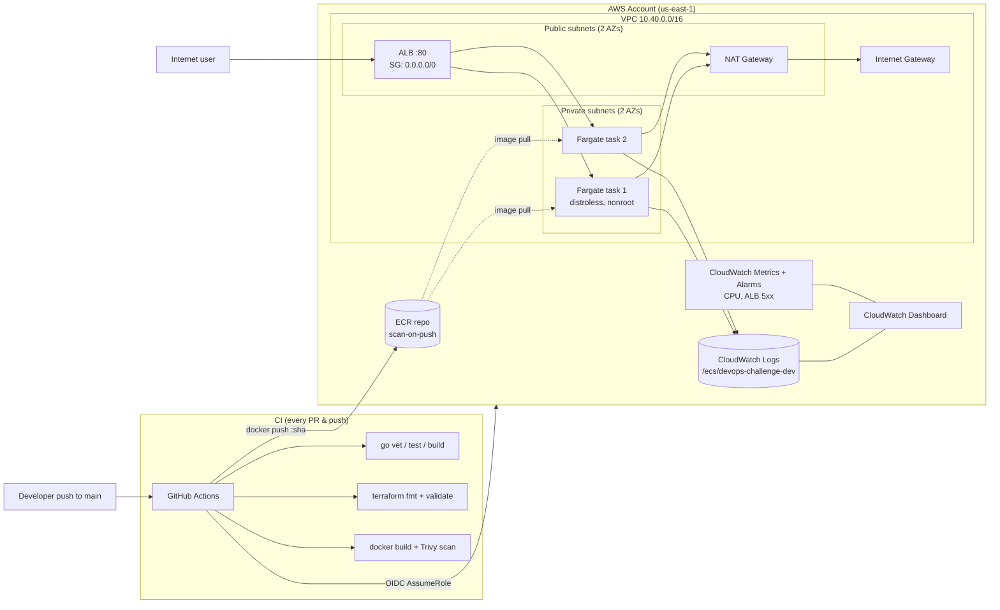

# Architecture

## Request flow

1. Client hits `http://<alb-dns>/` on port 80.
2. ALB terminates the connection and forwards to a healthy Fargate task in a private subnet (target type `ip`, awsvpc networking).
3. The Go service responds. stdout is captured by the `awslogs` driver and shipped to the `/ecs/<name>` log group.
4. CloudWatch Container Insights collects per-task CPU/memory; ALB emits request and 5xx counters.

## Deploy flow

1. PR opens → `ci.yml` runs (Go tests, `terraform validate`, Trivy scan). No AWS access.
2. Merge to `main` → `cd.yml` runs:
   - Assumes `gha_deployer` role via OIDC.
   - Builds image tagged with the short SHA, pushes to ECR.
   - Pulls the live task definition, replaces the image, registers a new revision.
   - Calls `UpdateService` and waits for stability. Circuit breaker auto-rolls back on failure.
